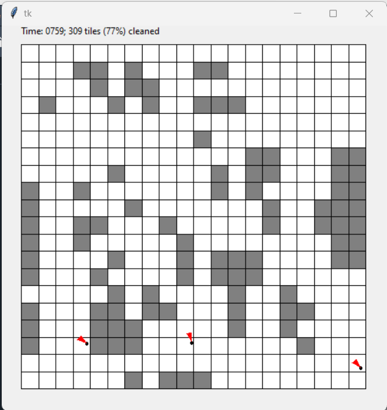
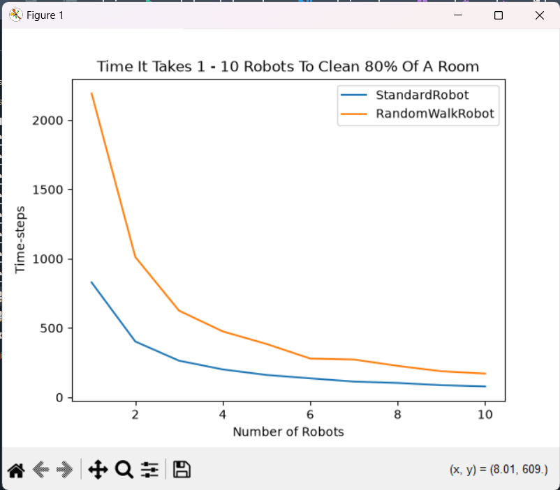
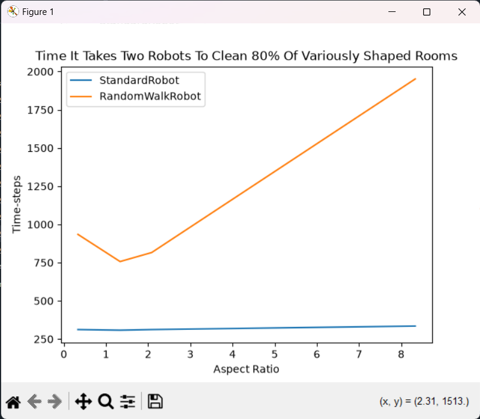

<p align="left">
  <a href="README.md">English</a> | <b>فارسی</b>
</p>

---
# شبیه‌سازی جاروبرقی هوشمند iRobot Roomba (پروژه MIT 6.00.2x)

یک موتور شبیه‌سازی زمان‌گسسته در پایتون برای مدلسازی ربات‌های جاروبرقی خودمختار در اتاق‌های مستطیلی جهت ارزیابی و مقایسه استراتژی‌های حرکت و کارایی تمیزکاری.

---

## جدول محتوا

* [توضیحات پروژه](#توضیحات-پروژه)
* [ویژگی‌ها](#ویژگی‌ها)
* [تکنولوژی‌های استفاده‌شده](#تکنولوژی‌های-استفاده‌شده)
* [ساختار پروژه](#ساختار-پروژه)
* [نصب و نحوه اجرا](#نصب-و-نحوه-اجرا)
* [تصمیمات طراحی و چالش‌های فنی](#تصمیمات-طراحی-و-چالش‌های-فنی)
* [اسکرین‌شات‌ها](#اسکرین‌شات‌ها)
* [تقدیر و تشکر](#تقدیر-و-تشکر)
* [مجوز (License)](#مجوز-license)
---

## توضیحات پروژه

این پروژه ربات‌های جاروبرقی خودمختار (مدل‌سازی‌شده بر اساس iRobot Roomba) را که در اتاق‌های مستطیلی کار می‌کنند شبیه‌سازی می‌کند. هدف اصلی، ارزیابی نحوه تأثیر استراتژی‌های مختلف حرکت بر زمان کل مورد نیاز برای تمیز کردن درصد مشخصی از اتاق است.

از طریق شبیه‌سازی‌های مونت‌کارلو در آزمون‌های مستقل متعدد، این موتور میانگین گام‌های زمانی مورد نیاز را تحت پیکربندی‌های مختلف (مانند تعداد متغیر ربات‌ها، الگوی حرکت، و ابعاد/نسبت ابعاد اتاق) محاسبه می‌کند.

---

## ویژگی‌ها

* **موتور شبیه‌سازی زمان‌گسسته**: محاسبه میانگین زمان تمیزکاری در $N$ آزمون برای حد نصاب‌های پوشش مشخص (`min_coverage`).
* **معماری شیءگرا**: استفاده از ارث‌بری کلاس‌ها برای جداسازی مدل‌های اتاق، محاسبات موقعیت و پیاده‌سازی استراتژی‌های حرکت.
* **استراتژی‌های حرکت چندریختی (Polymorphic)**:
* `StandardRobot`: تا زمانی که به دیوار برخورد نکند در یک مسیر مستقیم حرکت می‌کند و سپس یک جهت تصادفی جدید انتخاب می‌کند.
* `RandomWalkRobot`: در هر گام زمانی به صورت تصادفی جهت خود را تغییر می‌دهد.


* **همگام‌سازی چند ربات**: پشتیبانی از کارکرد هم‌زمان $N$ ربات در یک فضای فیزیکی مشترک.
* **تصویرسازی گرافیکی**: انیمیشن مبتنی بر Tkinter برای رندر به‌روزرسانی‌های لحظه‌ای وضعیت کاشی‌ها (از خاکستری به سفید).
* **ترسیم نمودار داده‌ها**: استفاده از `matplotlib` / `pylab` برای تولید نمودارهای مقایسه عملکرد (زمان در برابر تعداد ربات‌ها و زمان در برابر نسبت ابعاد اتاق).

---

## تکنولوژی‌های استفاده‌شده

* **پایتون ۳** (Python 3.x)
* **Matplotlib / PyLab**: برای تولید نمودارهای تحلیلی شبیه‌سازی.
* **Tkinter**: (کتابخانه استاندارد پایتون) برای تصویرسازی زنده شبیه‌سازی.
* **Math & Random**: (ماژول‌های استاندارد پایتون) برای محاسبات مثلثاتی موقعیت و توزیع‌های تصادفی یکنواخت.

---

## ساختار پروژه

```text
.
├── ps2.py              # منطق اصلی: کلاس‌های Position، Room، Robot، حلقه‌های شبیه‌سازی و رسم نمودار
├── ps2_visualize.py    # ماژول انیمیشن GUI با استفاده از Tkinter
└── README.md           # مستندات پروژه

```

---

## نصب و نحوه اجرا

### پیش‌نیازها

* نصب پایتون ۳ روی سیستم.
* نکته: کتابخانه‌های استاندارد `math` ،`random` و `tkinter` به صورت پیش‌فرض همراه با پایتون نصب می‌شوند.

### ۱. نصب

مخزن را کلون کرده و پکیج `matplotlib` را نصب کنید:

```bash
git clone https://github.com/mamadlari/MIT-6.00.2x.tree/main/Pset2
cd Pset2
pip install matplotlib

```

### ۲. پیکربندی و اجرا

برای اجرای پروژه، فایل `ps2.py` را باز کرده و خطوط انتهای فایل را بر اساس حالت مورد نظر از حالت کامنت خارج (uncomment) کنید:

* **برای نمایش معیارهای میانگین شبیه‌سازی در کنسول:**
فراخوانی‌های `print(runSimulation(...))` مربوطه را آنکامنت کنید.
* **برای رندر نمودارهای تحلیلی:**
فراخوانی‌های `showPlot1()` یا `showPlot2()` را در انتهای فایل `ps2.py` آنکامنت کنید.
* **برای فعال‌سازی انیمیشن لحظه‌ای:**
خطوط مربوط به تصویرسازی داخل `runSimulation()` را آنکامنت کنید:
```python
anim = ps2_visualize.RobotVisualization(num_robots, width, height)
# inside the simulation loop:
anim.update(room, robots)
# at trial completion:
anim.done()

```


اسکریپت را با دستور زیر اجرا کنید:

```bash
python ps2.py

```

---

## تصمیمات طراحی و چالش‌های فنی

### ۱. حرکت هم‌زمان در زمان گسسته

* **چالش**: مدلسازی حرکت هم‌زمان $N$ ربات در یک گام زمانی گسسته بدون ناهماهنگی زمانی.
* **راهکار**: در هر تیک ساعت، حلقه شبیه‌سازی روی تمام نمونه‌های ربات پیمایش کرده و `updatePositionAndClean()` را فراخوانی می‌کند. شمارنده گام زمانی کل تنها پس از پردازش حرکت و به‌روزرسانی وضعیت اتاق توسط تمام ربات‌های فعال، یک واحد افزایش می‌یابد.

### ۲. وضعیت مشترک اتاق و مدیریت حافظه

* **چالش**: اطمینان از اینکه همه $N$ ربات فعال، یک نمونه واحد از اتاق را به‌روزرسانی می‌کنند نه کپی‌های محلی خودشان را.
* **راهکار**: ارجاع یک شیء واحد از `RectangularRoom` در زمان مقداردهی اولیه به سازنده همه ربات‌ها پاس داده می‌شود. تغییر وضعیت تمیزی کاشی‌ها (`self.cleaned_tiles`) داخل این شیء مشترک، همگام‌سازی لحظه‌ای وضعیت را بین همه ربات‌ها تضمین می‌کند.

### ۳. ارث‌بری و الگوی استراتژی (Strategy Pattern)

* **چالش**: امکان استفاده از استراتژی‌های حرکت قابل تعویض در حلقه شبیه‌سازی بدون نیاز به تغییر تابع اجراکننده.
* **راهکار**: ویژگی‌های عمومی ربات (موقعیت، سرعت، ارجاع به اتاق) در یک کلاس پایه `Robot` انتزاع‌سازی شدند. کلاس‌های مشتق‌شده `StandardRobot` و `RandomWalkRobot` متد `updatePositionAndClean()` را بازنویسی (override) کرده و یک رابط چندریختی یکسان به `runSimulation(..., robot_type)` ارائه می‌دهند.

---

## اسکرین‌شات‌ها

>*خروجی حاصل از اجرای runSimulation(1, 1.0, 20, 20, 1, 30, RandomWalkRobot)*

```bash
Average number of time steps for RandomWalkRobot: 8573.766666666666

```
### شبیه‌سازی زنده و لحظه‌ای

### نمودارهای ارزیابی عملکرد

| زمان در برابر تعداد ربات‌ها | زمان در برابر نسبت ابعاد اتاق |
| :---: | :---: |
|    |  |

---

## تقدیر و تشکر

* **دوره MIT 6.00.2x: Introduction to Computational Thinking and Data Science** (دانشگاه MIT / edX) برای ارائه صورت مسئله و چارچوب اولیه پروژه.

---

## مجوز (License)

این پروژه متن‌باز بوده و تحت [پروانه MIT](https://www.google.com/search?q=LICENSE) منتشر شده است.
